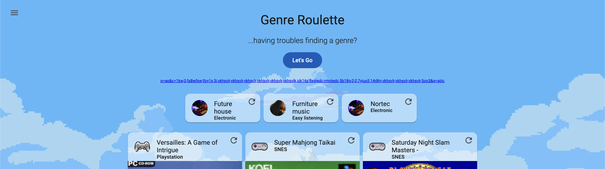

# VGM Roulette

A random video game and music genre discovery tool that helps users explore games across multiple platforms and music genres. The app randomly selects games and music genres based on user-defined filters.

**Live Demo**: [https://xal3ph.github.io/vgm-roulette/](https://xal3ph.github.io/vgm-roulette/)



## What It Does

VGM Roulette generates random combinations of:
- **Music Genres**: Randomly selects from categorized music genres (Rock, Jazz, Electronic, etc.)
- **Video Games**: Randomly selects games from 30+ gaming platforms with metadata and images from Wikipedia

Users can filter by gaming platforms and music genre categories, with selections persisted via URL hash for sharing.

## Getting Started

### Prerequisites
- Node.js (v18+)
- npm or yarn

### Installation
```bash
npm install
```

### Development Server
```bash
npm start
# or
ng serve
```
Navigate to `http://localhost:4200/`

### Build
```bash
npm run build
```
Build artifacts stored in `dist/`

### Deploy
```bash
npm run deploy
```
Deploys to GitHub Pages

## Architecture

### Core Components

**VgmRouletteComponent** (`vgm-roulette/`)
- Main container with animated parallax background
- Orchestrates genre and game rolling
- Manages URL hash state for filter persistence
- Displays genre and game cards

**GameComponent** (`game/`)
- Displays individual game cards with cover art, platform icons, and external links
- Links to Wikipedia, Zophar.net, and KHInsider for music resources

**GenreComponent** (`genre/`)
- Displays music genre cards with category images
- Links to Wikipedia for genre information

**OptionsDrawerComponent** (`options-drawer/`)
- Side drawer for filtering options
- Contains console and genre filter sub-components

**OptionsConsoleComponent** (`options-drawer/options-console/`)
- Platform filter using Material chips
- Filters games by selected consoles

**OptionsGenreComponent** (`options-drawer/options-genre/`)
- Hierarchical genre filter with parent/child categories
- Checkbox tree for genre selection

### Services

**GameService** (`game/game.service.ts`)
- Loads game data from 30+ JSON files (NES, SNES, PS1, Xbox, etc.)
- Fetches game cover images from Wikipedia API
- Manages platform filtering and random game selection
- Encodes/decodes filter state to URL-safe format

**GenreService** (`genre/genre.service.ts`)
- Manages music genre data from categorized JSON
- Handles parent/child genre filtering
- Random genre selection based on active filters
- Encodes/decodes genre state to URL-safe format

### Data Flow

1. **Initialization**: Services load game/genre data from JSON assets
2. **Filtering**: User selects platforms/genres via options drawer
3. **State Persistence**: Filters encoded to binary, converted to base36, stored in URL hash
4. **Rolling**: Random selection from filtered datasets
5. **Display**: Cards rendered with fetched Wikipedia images

### State Management

- RxJS BehaviorSubjects for reactive state
- URL hash encoding: `#p={genres}&c={subgenres}&g={platforms}`
- Binary-to-base36 encoding for compact URLs

### Key Technologies

- **Angular 18**: Standalone components, signals
- **Angular Material**: UI components (cards, chips, drawer, toolbar)
- **RxJS**: Reactive state management
- **Wikipedia API**: Game cover art and metadata
- **Angular Flex Layout**: Responsive grid layouts

## Project Structure

```
src/app/
├── game/                    # Game card component & service
├── genre/                   # Genre card component & service
├── options-drawer/          # Filter drawer
│   ├── options-console/     # Platform filter
│   └── options-genre/       # Genre filter
├── vgm-roulette/           # Main component
├── utils/                   # Binary/URL encoding utilities
└── app.component.ts         # Root with navigation drawer

src/assets/
├── data/                    # Game & genre JSON files
└── images/                  # Console & genre images
```

## Data Sources

- Game data: [EveryVideoGameEver](https://github.com/Elbriga14/EveryVideoGameEver)
- Cover art: Wikipedia API
- Music resources: Zophar.net, KHInsider

## Features

- 30+ gaming platforms (NES to PS4, Switch, Xbox One)
- Hierarchical music genre filtering
- Animated parallax background
- Shareable filter configurations via URL
- Responsive Material Design UI
- External music archive integration
